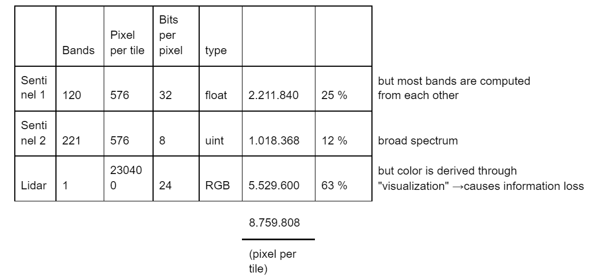

# Maya Contest Machine Learning Pipeline

Hint: for installation & run instructions go to section "Installation and Deployment"

## Overview of the solution pipeline
We applied these seven steps to obtain the results:

1. _Synthetic data generation_. As with many archaeological datasets, the original dataset turned out to have insufficient samples for the classes to be detected properly. So we use image processing techniques to create additional images and masks out of the available samples. → see section (3) Synthetic data generation below.
2. _Mask re-formatting (“normalization”)_. The library fastai (www.fast.ai) from Univ. San Francisco, which we use, requires binary segmentation masks to be “normalized” in the [0, 1] value range, so we re-formatted the provided masks from images with values [255, 0] to [0,1]. This is super easy, so we only provide the normalized masks. But in case you want the source code, just let us know.
3. _Deep Learning model training_. For each object class in {aguada, platform, building} a total of 2 x 5 neural networks are trained as follows:
    1. the LiDAR training dataset including the synthetic data (from step A above) is randomly shuffled and then split into 5 “folds” of equal size ( “K-Fold cross validation”, here K=5) which iteratively serve as validation dataset (and the remaining 4 folds are used as the training dataset), resulting into a 80% / 20% training / validation data split.
    2. Each of these 5 datasets then serves as input for training two different neural network architectures, namely:
        1. a DeepLabV3+ with ResNet-101 backbone
        2. an HRNet with HRNet_W30 backbone 
           
    For details see section (4) below.
4. _Prediction_. For each object class the resulting 2 x 5 = 10 neural network models are then used to make predictions for each image in the test dataset of the competition. The results are ensembled, that is, the mean of all predictions (in [0.0 … 1.0]) is computed (no further weights applied).
5. _Intermediate result: grayscale image_. The resulting number (mean) is then re-scaled from [0..1] to [0 255] for each pixel and stored as a grayscale image. (Note that this causes some precision loss but the effect is negligible).
6. _Apply filters_. Two filters are applied to vary thresholds for the segmentation certainty and minimal object area (see section (5) post-processing)
7.  _Convert output to npz format_. This is done based on the code provided by the competition organizers, so we do not document it here.

## Results of our data analysis
These observations were key factors when designing the solution:
1. _Sentinel satellite data not used_. For obvious reasons the Sentinel datasets are both of substantially lower resolution than the LiDAR data, so we assessed their contribution to be inferior or even negligible for the machine learning pipeline.
   The table below shows that only under super-optimistic circumstances the Sentinel data contributes only 25%+12% = 37% of the information value per tile. In reality, this is much lower, as a substantial amount of redundancy can be assumed with all bands.

